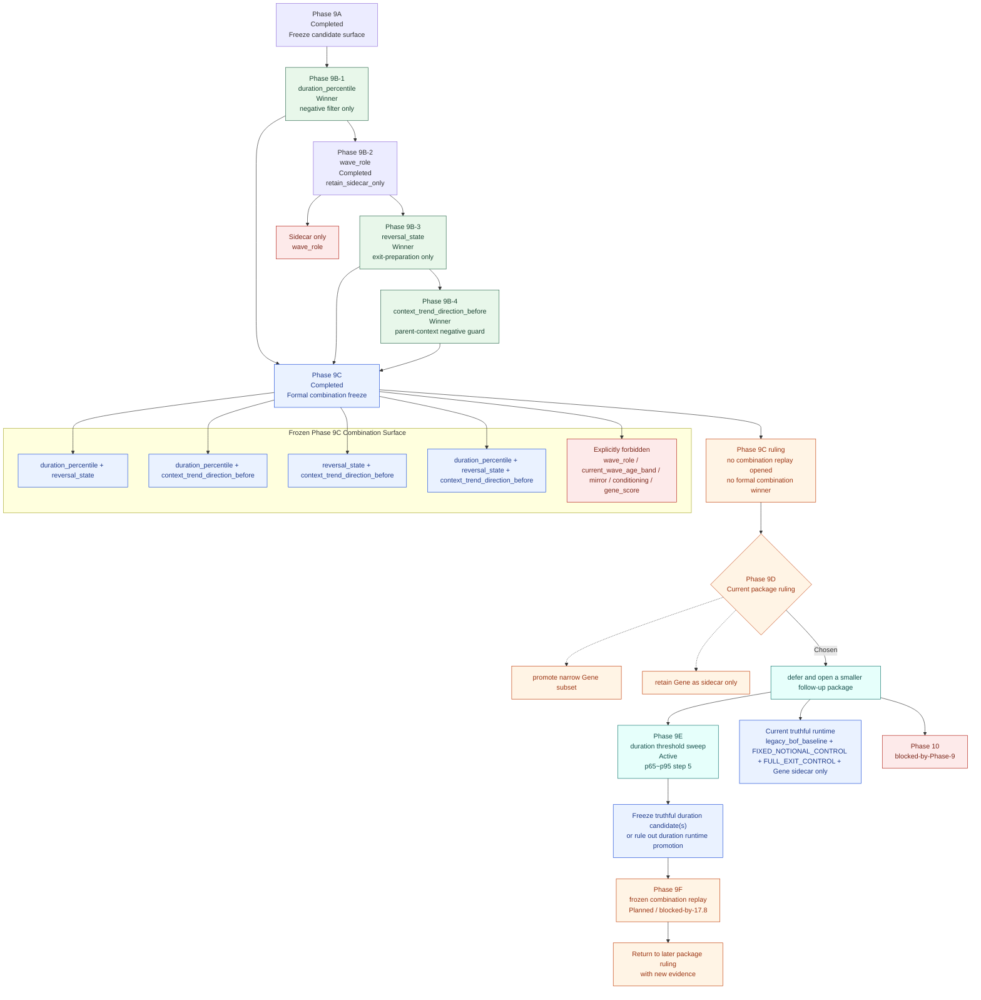

# Phase 9 Gene Promotion Flowchart

**状态**: `Completed`  
**日期**: `2026-03-19`

---

## 1. 用途

这张图只做一件事：

`把 Phase 9A -> 9B -> 9C -> 9D -> 9E -> 9F 的真实推进路径画清楚，明确哪些字段已赢下 isolated round，哪些组合只被冻结未打开 replay，以及为什么当前包级结论是 defer 而不是已 promotion。`

---

## 2. Flowchart

---

## 3. 读图结论

这张图当前对应的正式结论是：

1. `duration_percentile`、`reversal_state`、`context_trend_direction_before` 都已赢下 isolated round
2. `wave_role` 已完成 isolated validation，但 ruling 是 `retain_sidecar_only`
3. `Phase 9C` 只冻结组合面，没有打开 combination replay
4. `Phase 9C has no formal combination winner`
5. `Phase 9D` 当前选择的是：
   `defer and open a smaller follow-up package`
6. 当前主线仍然是：
   `legacy_bof_baseline + FIXED_NOTIONAL_CONTROL + FULL_EXIT_CONTROL + Gene sidecar only`
7. 当前真实下一步是：
   - `17.8 / duration threshold sweep`
   - 然后 `17.9 / frozen combination replay`
