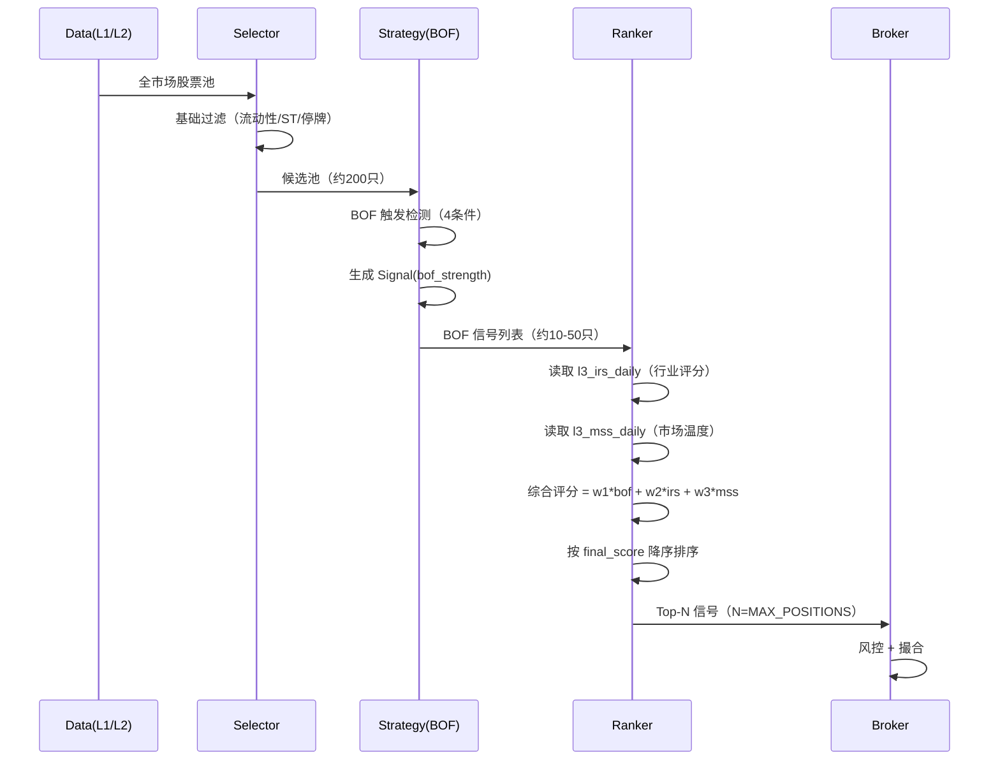

# Down-to-Top 策略层集成设计（v0.01-plus）

**版本**: v0.01-plus 草案  
**创建日期**: 2026-03-07  
**状态**: Draft（待验证）  
**前置依赖**: `system-baseline.md`, `selector-design.md`, `strategy-design.md`, `pas-algorithm.md`  
**证据支持**: `docs/spec/v0.01/evidence/v0.01-evidence-review-20260306.md`

---

## 1. 设计动机

### 1.1 证据结论

`v0.01-evidence-review-20260306.md` 的核心发现：

> **当前最可信的方向，不是 MSS hard gate，而是 BOF 触发 + IRS 横截面筛选 + MSS soft overlay。**

全周期 A/B 对比：

| 配置 | trade_count | EV | PF | MDD |
|------|-------------|----|----|-----|
| BOF baseline | 294 | -0.00716 | 2.13 | 0.228 |
| BOF + MSS hard gate | 16 | +0.03935 | 2.63 | 0.014 |
| BOF + MSS soft + IRS top10 | 133 | +0.01962 | 2.93 | 0.051 |

**关键发现**：
- MSS hard gate 把样本压到 16 笔（过度稀疏）
- soft_gate + IRS 组合改善了 baseline（EV 转正、MDD 减半）
- 真正有效的不是"前置硬过滤"，而是"后置评分排序"

### 1.2 当前设计的问题

`selector-design.md` §6.2 仍然写的是：

```python
if config.ENABLE_MSS_GATE:
    if mss.signal == "BEARISH":
        return []  # 今日不出手
```

这是 **top-down 硬门控**，与证据结论矛盾。

---

## 2. Down-to-Top 链路定义

### 2.1 核心思想

```
基础过滤 → BOF 触发 → 叠加 IRS/MSS 评分 → 综合排序 → Top-N → Broker
```

**关键变化**：
- MSS/IRS 不再是"前置过滤器"，而是"后置评分项"
- BOF 先触发，再用 IRS/MSS 做优先级排序
- 所有 BOF 信号都保留，只是排序靠后的不执行（因为仓位有限）

### 2.2 与 top-down 的对比

| 维度 | Top-Down（旧） | Down-to-Top（新） |
|------|---------------|------------------|
| MSS 职责 | 硬门控（BEARISH → 不出手） | 软评分（BEARISH → 降低优先级） |
| IRS 职责 | 硬过滤（只看 Top-N 行业） | 软评分（行业排名 → 加权分） |
| BOF 触发时机 | 在 MSS/IRS 过滤后 | 在基础过滤后立即触发 |
| 样本保留 | 大量误杀（短窗归零） | 保留所有 BOF，只排序 |
| 仓位分配 | 先过滤再分配 | 先触发再按综合分排序分配 |

---

## 3. 数据流设计

### 3.1 完整流程



### 3.2 关键变化点

**变化 1：Selector 不再做 MSS/IRS 过滤**

```python
# 旧逻辑（selector.py）
if ENABLE_MSS_GATE and mss.signal == "BEARISH":
    return []  # ❌ 硬门控

# 新逻辑（selector.py）
# MSS/IRS 只写入 L3，不在 Selector 里过滤
# Selector 只做基础过滤
```

**变化 2：Strategy 叠加 IRS/MSS 评分**

```python
# 旧逻辑（strategy.py）
for candidate in candidates:
    signal = bof_detector.detect(candidate)
    if signal:
        signals.append(signal)  # ❌ 只有 bof_strength

# 新逻辑（strategy.py）
for candidate in candidates:
    signal = bof_detector.detect(candidate)
    if signal:
        # 叠加 IRS 评分
        irs_score = get_industry_score(signal.code, signal_date)
        # 叠加 MSS 评分
        mss_score = get_market_score(signal_date)
        # 综合评分
        signal.final_score = (
            0.5 * signal.bof_strength +
            0.3 * irs_score +
            0.2 * mss_score
        )
        signals.append(signal)

# 按 final_score 降序排序
signals.sort(key=lambda s: s.final_score, reverse=True)
return signals[:MAX_POSITIONS]  # Top-N
```

---

## 4. 模块职责变化

### 4.1 Selector

**旧职责**：
- MSS gate（BEARISH → 返回空）
- IRS filter（只保留 Top-N 行业）
- 基础过滤

**新职责**：
- 只做基础过滤（流动性/ST/停牌/市值）
- 输出候选池（约200只）
- MSS/IRS 只写入 L3，不在 Selector 里使用

### 4.2 Strategy

**旧职责**：
- BOF 触发检测
- 输出 Signal（只有 bof_strength）

**新职责**：
- BOF 触发检测
- 叠加 IRS/MSS 评分
- 计算 final_score
- 按 final_score 排序，输出 Top-N

### 4.3 MSS/IRS

**旧职责**：
- MSS：硬门控（BEARISH → 全局停止）
- IRS：硬过滤（只保留 Top-N 行业）

**新职责**：
- MSS：提供市场温度评分（0-100）
- IRS：提供行业排名评分（1-31 → 归一化到 0-100）
- 两者都只写入 L3，不直接控制交易

---

## 5. Contracts 变化

### 5.1 Signal 新增字段

```python
class Signal(BaseModel):
    signal_id: str
    code: str
    signal_date: date
    action: str
    pattern: str
    reason_code: str
    
    # ── 新增字段 ──
    bof_strength: float        # BOF 原始强度（0-1）
    irs_score: float           # 行业评分（0-100）
    mss_score: float           # 市场温度（0-100）
    final_score: float         # 综合评分（0-100）
    
    # ── 保留字段（兼容） ──
    strength: float = 0.0      # 向后兼容，等于 bof_strength
    
    @model_validator(mode="after")
    def _set_signal_id(self):
        if not self.signal_id:
            self.signal_id = f"{self.code}_{self.signal_date}_{self.pattern}"
        # 向后兼容
        if self.strength == 0.0:
            self.strength = self.bof_strength
        return self
```

### 5.2 MarketScore / IndustryScore 不变

MSS/IRS 的输出契约不变，仍然是：

```python
class MarketScore(BaseModel):
    date: date
    score: float      # 0-100
    signal: str       # BULLISH/NEUTRAL/BEARISH（仅作标签，不控制交易）

class IndustryScore(BaseModel):
    date: date
    industry: str
    score: float
    rank: int         # 1-31
```

**关键变化**：
- `MarketScore.signal` 不再触发"今日不出手"
- `IndustryScore.rank` 不再触发"只看 Top-N 行业"
- 两者都只是评分输入，不是硬门控

---

## 6. 综合评分公式

### 6.1 默认权重（v0.01-plus）

```python
# config.py
DTT_BOF_WEIGHT = 0.5      # BOF 触发强度
DTT_IRS_WEIGHT = 0.3      # 行业相对强度
DTT_MSS_WEIGHT = 0.2      # 市场环境加成
```

**权重设计原则**：
- BOF 最高（50%）：形态触发是核心
- IRS 次之（30%）：行业轮动是横截面筛选
- MSS 最低（20%）：市场环境是软约束

### 6.2 评分归一化

```python
def calculate_final_score(signal: Signal, irs_score: float, mss_score: float) -> float:
    """
    综合评分计算（0-100）
    
    输入：
    - signal.bof_strength: 0-1（BOF 原始强度）
    - irs_score: 0-100（行业评分，rank=1 → 100, rank=31 → 0）
    - mss_score: 0-100（市场温度）
    
    输出：
    - final_score: 0-100
    """
    # BOF 强度归一化到 0-100
    bof_normalized = signal.bof_strength * 100
    
    # 加权求和
    final_score = (
        config.DTT_BOF_WEIGHT * bof_normalized +
        config.DTT_IRS_WEIGHT * irs_score +
        config.DTT_MSS_WEIGHT * mss_score
    )
    
    return final_score
```

### 6.3 IRS rank 归一化

```python
def irs_rank_to_score(rank: int, total_industries: int = 31) -> float:
    """
    行业排名转评分（线性映射）
    rank=1 → 100, rank=31 → 0
    """
    return 100 * (1 - (rank - 1) / (total_industries - 1))
```

---

## 7. 实现要点

### 7.1 Strategy 改造

```python
# src/strategy/strategy.py

def generate_signals(
    store: Store,
    candidates: list[StockCandidate],
    calc_date: date,
) -> list[Signal]:
    """
    生成信号（down-to-top 模式）
    """
    signals = []
    
    # 1. BOF 触发检测
    for candidate in candidates:
        df = _prepare_history(store, candidate.code, calc_date)
        signal = bof_detector.detect(df, calc_date)
        if signal:
            signals.append(signal)
    
    if not signals:
        return []
    
    # 2. 读取 IRS/MSS 评分
    irs_df = store.read_df(
        "SELECT industry, rank FROM l3_irs_daily WHERE date = ?",
        (calc_date,)
    )
    mss_row = store.read_df(
        "SELECT score FROM l3_mss_daily WHERE date = ?",
        (calc_date,)
    )
    
    # 3. 叠加评分
    for signal in signals:
        # 获取该股票的行业
        industry = _get_industry(store, signal.code, calc_date)
        
        # IRS 评分
        irs_rank = irs_df[irs_df["industry"] == industry]["rank"].iloc[0]
        signal.irs_score = irs_rank_to_score(irs_rank)
        
        # MSS 评分
        signal.mss_score = mss_row["score"].iloc[0] if not mss_row.empty else 50.0
        
        # 综合评分
        signal.final_score = calculate_final_score(signal, signal.irs_score, signal.mss_score)
    
    # 4. 排序 + Top-N
    signals.sort(key=lambda s: s.final_score, reverse=True)
    return signals[:config.MAX_POSITIONS]
```

### 7.2 Selector 简化

```python
# src/selector/selector.py

def select_candidates(store: Store, calc_date: date) -> list[StockCandidate]:
    """
    候选池生成（down-to-top 模式）
    
    变化：删除 MSS gate 和 IRS filter
    """
    # 全市场股票池
    all_stocks = store.read_df(
        "SELECT DISTINCT code FROM l2_stock_adj_daily WHERE date = ?",
        (calc_date,),
    )
    
    # 基础过滤（流动性/ST/停牌/市值）
    candidates = _apply_basic_filters(store, all_stocks["code"].tolist(), calc_date)
    
    # ❌ 删除：MSS gate
    # ❌ 删除：IRS filter
    
    # 直接返回候选池
    return [StockCandidate(code=c, industry="", score=0.0) for c in candidates]
```

---

## 8. 配置开关

### 8.1 新增配置

```python
# config.py

# ── Down-to-Top 模式开关 ──
ENABLE_DTT_MODE = False           # v0.01 默认关闭，v0.01-plus 开启

# ── Down-to-Top 权重 ──
DTT_BOF_WEIGHT = 0.5
DTT_IRS_WEIGHT = 0.3
DTT_MSS_WEIGHT = 0.2

# ── 旧配置（兼容） ──
ENABLE_MSS_GATE = True            # DTT 模式下无效
ENABLE_IRS_FILTER = True          # DTT 模式下无效
```

### 8.2 模式切换

```python
# src/strategy/strategy.py

def generate_signals(...):
    if config.ENABLE_DTT_MODE:
        return _generate_signals_dtt(...)  # Down-to-Top
    else:
        return _generate_signals_legacy(...)  # Top-Down
```

---

## 9. 消融实验矩阵

### 9.1 对比实验

| 场景 | 模式 | MSS | IRS | 说明 |
|------|------|-----|-----|------|
| baseline | legacy | ❌ | ❌ | 纯 BOF |
| legacy_mss | legacy | ✅ hard | ❌ | Top-Down + MSS gate |
| legacy_mss_irs | legacy | ✅ hard | ✅ filter | Top-Down + MSS + IRS |
| dtt_bof_only | DTT | ❌ | ❌ | Down-to-Top 纯 BOF |
| dtt_bof_irs | DTT | ❌ | ✅ score | Down-to-Top + IRS 评分 |
| dtt_full | DTT | ✅ score | ✅ score | Down-to-Top 完整 |

### 9.2 关键指标

每个场景必须输出：
- `bof_hit_count`（BOF 触发数）
- `final_selected_count`（最终选中数）
- `trade_count / EV / PF / MDD`
- `environment_breakdown`

---

## 10. 验收标准

### 10.1 功能验收

- [ ] DTT 模式下，BOF 触发数 ≈ baseline（不被 MSS/IRS 误杀）
- [ ] DTT 模式下，final_score 排序正确（高分优先）
- [ ] DTT 模式下，IRS/MSS 缺失时有兜底（默认 50 分）
- [ ] legacy 模式仍然可用（向后兼容）

### 10.2 性能验收

- [ ] `dtt_full` 相对 `baseline` 的 EV 改善 ≥ 10%
- [ ] `dtt_full` 相对 `baseline` 的 MDD 改善 ≥ 20%
- [ ] `dtt_full` 的 trade_count ≥ 60（样本充足）

### 10.3 证据验收

- [ ] 生成 `v0.01-dtt-ablation-YYYYMMDD.json`
- [ ] 包含 6 个场景的完整对比
- [ ] 包含 environment_breakdown

---

## 11. 与 v0.02 的关系

**v0.01-plus 不是 v0.02**：
- v0.02 是"加入 BPB 形态"（形态扩展）
- v0.01-plus 是"改变 MSS/IRS 使用方式"（链路重构）

**两者可以并行**：
- v0.01-plus 验证通过后，可以作为 v0.02 的基础
- 或者 v0.02 仍然用 legacy 模式，v0.03 再切 DTT

**当前建议**：
- 先验证 v0.01-plus（1-2 周）
- 如果 DTT 证明有效，v0.02 直接基于 DTT
- 如果 DTT 证明无效，v0.02 继续用 legacy

---

## 12. 风险与限制

### 12.1 已知风险

1. **权重敏感性**：0.5/0.3/0.2 是拍脑袋的，需要网格搜索
2. **IRS 归一化**：线性映射可能不是最优（可能需要非线性）
3. **MSS 稀疏性**：当前 MSS 分布过窄，评分区分度不足

### 12.2 缓解措施

1. 权重敏感性 → 做权重网格实验（0.4/0.4/0.2, 0.6/0.3/0.1 等）
2. IRS 归一化 → 尝试指数映射（rank=1 → 100, rank=10 → 50, rank=31 → 0）
3. MSS 稀疏性 → 考虑用 percentile 替代 zscore（见 `mss-algorithm.md`）

---

## 13. 下一步行动

### 13.1 代码改造（3-5 天）

1. 修改 `src/contracts.py`：Signal 新增字段
2. 修改 `src/selector/selector.py`：删除 MSS/IRS 硬过滤
3. 修改 `src/strategy/strategy.py`：叠加 IRS/MSS 评分
4. 新增 `src/strategy/ranker.py`：综合评分逻辑
5. 修改 `src/config.py`：新增 DTT 配置

### 13.2 测试验证（2-3 天）

1. 单元测试：`test_ranker.py`（评分计算）
2. 集成测试：`test_strategy_dtt.py`（完整链路）
3. 消融实验：6 个场景全跑一遍

### 13.3 证据产出（1 天）

1. 生成 `v0.01-dtt-ablation-YYYYMMDD.json`
2. 更新 `v0.01-evidence-review.md`
3. 决策：DTT 是否作为 v0.02 基础

---

## 14. 参考文献

- `docs/spec/v0.01/evidence/v0.01-evidence-review-20260306.md`（证据支持）
- `docs/spec/v0.01/evidence/v0.01-selector-ablation-mss-fullcycle-ab-20260306.json`（数据来源）
- `docs/design-v2/system-baseline.md`（执行语义）
- `docs/design-v2/selector-design.md`（Selector 原设计）
- `docs/design-v2/strategy-design.md`（Strategy 原设计）
