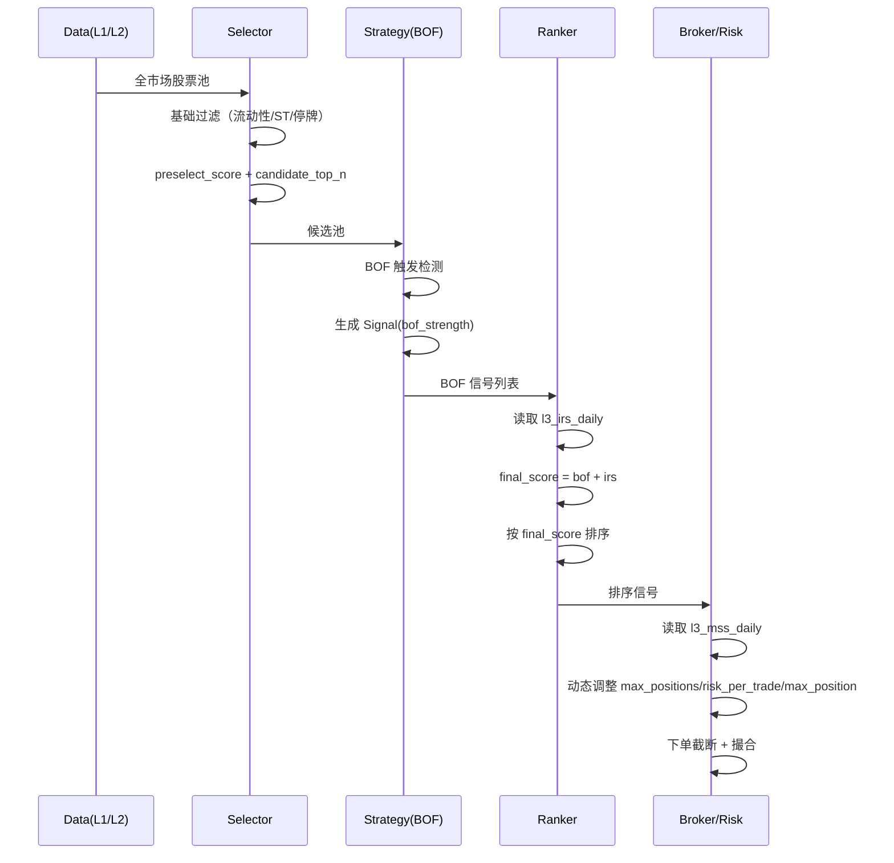

# Down-to-Top 主线替代设计（v0.01-plus）

**版本**: `v0.01-plus 主线替代版`  
**状态**: `Active`  
**封版日期**: `不适用（Active SoT）`  
**变更规则**: `作为 v0.01-plus 当前主开发线设计入口，允许在 Gate、证据与实现反馈下受控修订；涉及 v0.01 Frozen 历史口径时，以上游 baseline 为准。`  
**上游文档**: `docs/design-v2/01-system/system-baseline.md`, `docs/design-v2/02-modules/selector-design.md`, `docs/design-v2/02-modules/strategy-design.md`, `docs/design-v2/03-algorithms/core-algorithms/pas-algorithm.md`  
**治理入口**: `docs/spec/v0.01-plus/README.md`  
**创建日期**: `2026-03-07`  
**证据支持**: `docs/spec/v0.01/evidence/v0.01-evidence-review-20260306.md`

---

## 1. 设计动机

### 1.1 当前主线结论

`v0.01-plus` 当前主开发线已经明确收口为：

`Selector 初选 -> BOF 触发 -> IRS 排序 -> MSS 控仓位 -> Broker 执行`

这条链路与 `v0.01 Frozen` 的 legacy top-down 已经不是同一套系统心智模型。

### 1.2 版本边界

`selector-design.md` 与 `system-baseline.md` 继续保留为 `v0.01 Frozen` 的历史正式口径：基础过滤后仍执行 `MSS gate + IRS filter`。它们保留为历史基线、对照组和回退参考。

本文件承担的是当前主线职责：

1. 定义 `v0.01-plus` 当前主开发线的 `down-to-top` 主链。
2. 让 `DTT` 作为替代 legacy top-down 的默认目标，而不是继续停留在“独立实验版”。
3. 在保持 `v0.01 Frozen` 可回放的前提下，给后续代码实现提供当前 SoT。

---

## 2. Down-to-Top 链路定义

### 2.1 核心思想

```text
基础过滤 -> BOF 触发 -> IRS 排序 -> MSS 控仓位 -> Broker 执行
```

**关键变化**：
- `Selector` 不再做 `MSS/IRS` 交易决策。
- `BOF` 先触发，再用 `IRS` 做横截面排序。
- `MSS` 不再进入个股横截面总分，而是进入 `Broker / Risk` 控制仓位与持仓上限。
- `Strategy` 负责排序，`Broker` 负责执行截断。

### 2.2 与 top-down 的对比

| 维度 | Top-Down（旧） | Down-to-Top（新） |
|------|---------------|------------------|
| MSS 职责 | 前置 gate / soft gate | 市场级控仓位 |
| IRS 职责 | 前置硬过滤 | 后置排序增强 |
| BOF 触发时机 | 在 MSS/IRS 过滤后 | 在基础过滤后立即触发 |
| 样本保留 | 先删样本再触发 | 先触发再排序 |
| 仓位分配 | 过滤后固定分配 | 排序后由 Broker 按约束执行 |

---

## 3. 数据流设计

### 3.1 完整流程



### 3.2 关键变化点

**变化 1：Selector 不再做 MSS/IRS 过滤**

```python
# 新逻辑（selector.py）
# Selector 只做基础过滤、规模控制和候选准备
# MSS/IRS 不再参与候选阶段交易决策
```

**变化 2：Strategy 只做 BOF + IRS 排序**

```python
# 新逻辑（ranker.py）
# final_score 只由 bof_strength + irs_score 形成
# MSS 不再进入横截面总分
```

**变化 3：Broker / Risk 才消费 MSS**

```python
# 新逻辑（risk.py）
# 按 signal_date 读取 l3_mss_daily
# 动态调节 max_positions / risk_per_trade_pct / max_position_pct
```

---

## 4. 模块职责变化

### 4.1 Selector

**当前主线职责**：
- 基础过滤（停牌/ST/上市天数/流动性/关键字段）
- 规模控制（`candidate_top_n`）
- 生成 `preselect_score`

**不再负责**：
- `MSS gate`
- `IRS filter`
- 市场状态停手
- 行业硬过滤

### 4.2 Strategy

**当前主线职责**：
- `BOF` 触发检测
- 生成 `bof_strength`
- 读取 `IRS` 并形成 `final_score`
- 生成排序信号与 sidecar 明细

**不再负责**：
- 市场级控仓位
- 最终下单数量
- 账户现金与持仓约束

### 4.3 Broker / Risk

**当前主线职责**：
- 接收排序信号
- 读取 `MSS` 市场状态
- 动态调节：
  - `max_positions`
  - `risk_per_trade_pct`
  - `max_position_pct`
- 决定实际可执行订单集合

### 4.4 MSS / IRS

**IRS 当前职责**：
- 行业横截面增强因子
- 进入 `Strategy` 排序层

**MSS 当前职责**：
- 市场级风险调节因子
- 进入 `Broker / Risk` 执行层

---

## 5. Contracts 变化

### 5.1 当前迁移策略：兼容优先 + sidecar

`v0.01-plus` 已升格为当前主开发线，但第一阶段不要求下游 `Broker / Backtest / Report` 立刻跟着做全量 schema 改造。

当前迁移策略：

1. 正式 `Signal / Order / Trade` 契约先保持 `v0.01` 兼容形态，保证下游切换面可控。
2. `DTT` 排序所需的 `bof_strength / irs_score / mss_score / final_score / final_rank` 统一写入 `l3_signal_rank_exp`。
3. 若后续决定把这些字段正式并入 `Signal`，必须另立 migration note 和 compatibility 方案。

### 5.2 MarketScore / IndustryScore 角色调整

MSS/IRS 的输出契约对象不必立刻改名，但当前主线消费方向已经改变：

```python
class MarketScore(BaseModel):
    date: date
    score: float
    signal: str

class IndustryScore(BaseModel):
    date: date
    industry: str
    score: float
    rank: int
```

**关键变化**：
- `MarketScore` 当前主线消费者是 `Broker / Risk`，不再是 `Selector`。
- `IndustryScore` 当前主线消费者是 `Strategy / Ranker`，不再是 `Selector`。
- 两者都不再承担前置硬门控职责。

---

## 6. 评分与风控

### 6.1 横截面排序

当前主线约束：

```text
final_score = f(bof_strength, irs_score)
```

设计原则：
- `BOF` 是主信号，必须占主导。
- `IRS` 是横截面增强因子，用于区分同日多信号优先级。
- `MSS` 不进入横截面总分。

### 6.2 执行层风险覆盖

当前主线约束：

```text
MSS -> Broker/Risk -> max_positions / risk_per_trade_pct / max_position_pct
```

设计原则：
- `MSS` 是市场环境，不是个股区分度因子。
- `MSS` 的价值体现在风险折扣、持仓上限和单笔暴露限制。
- `MSS` 不再通过缩小 `candidate_top_n` 或停手逻辑影响 BOF 触发覆盖。

---

## 7. 实现要点

### 7.1 Strategy

```python
# 主线职责
candidates -> BOF detect -> bof_strength
signals -> attach irs_score -> final_score
signals -> rank -> output sidecar + selected signals
```

### 7.2 Broker / Risk

```python
# 主线职责
ranked_signals -> read l3_mss_daily
-> adjust max_positions / risk_per_trade / max_position
-> execute feasible orders
```

### 7.3 Selector

```python
# 主线职责
all_stocks -> hard filters -> preselect_score -> candidate_top_n
```

---

## 8. 配置开关

### 8.1 当前配置口径

```python
PIPELINE_MODE = "dtt"
DTT_VARIANT = "v0_01_dtt_bof_plus_irs_score"
MSS_RISK_OVERLAY_VARIANT = "v0_01_dtt_bof_plus_irs_mss_score"
```

### 8.2 模式含义

- `legacy_bof_baseline`：旧漏斗，仅作 compare / rollback。
- `v0_01_dtt_bof_only`：只验证 BOF。
- `v0_01_dtt_bof_plus_irs_score`：`BOF + IRS` 排序主线。
- `v0_01_dtt_bof_plus_irs_mss_score`：`BOF + IRS` 排序 + `MSS` 控仓位。

---

## 9. 消融实验矩阵

### 9.1 当前建议矩阵

| 场景 | Selector | 排序层 | 风控层 | 说明 |
|------|----------|--------|--------|------|
| `legacy_bof_baseline` | legacy | BOF only | 固定 | 历史对照 |
| `v0_01_dtt_bof_only` | DTT | BOF only | 固定 | 触发保真 |
| `v0_01_dtt_bof_plus_irs_score` | DTT | BOF + IRS | 固定 | 排序增益 |
| `v0_01_dtt_bof_plus_irs_mss_score` | DTT | BOF + IRS | MSS 覆盖 | 风控贡献 |

### 9.2 关键指标

每个场景必须输出：
- `bof_hit_count`
- `final_selected_count`
- `trade_count / EV / PF / MDD`
- `reject_rate / participation_rate`
- `environment_breakdown`

---

## 10. 验收标准

### 10.1 功能验收

- [ ] DTT 模式下，BOF 触发覆盖不再受到 `MSS/IRS` 候选阶段拦截。
- [ ] `IRS` 排序结果可复现，且能通过 sidecar 回放。
- [ ] `MSS` 缺失时有中性兜底，不导致链路中断。
- [ ] legacy 模式仍然可用。

### 10.2 证据验收

- [ ] 能区分“排序增益”和“风控贡献”。
- [ ] 能按执行日解释 `IRS` 改票、`MSS` 改仓位带来的差异。
- [ ] 能通过 `run_id + signal_id` 追溯排序与执行。

---

## 11. 与 v0.02 的关系

**v0.01-plus 不是 v0.02**：
- `v0.02` 是后续形态扩展版本（如 BPB）。
- `v0.01-plus` 是当前主开发线中的链路替代版本（legacy top-down -> DTT）。

**当前建议**：
- 先完成 `v0.01-plus` 主线切换与证据收口。
- legacy 保留为 compare / rollback。
- 切换完成后，再决定 `v0.02` 是否直接继承 DTT 主链。

---

## 12. 风险与限制

### 12.1 已知风险

1. `IRS` 已能改变执行，但收益改善尚未稳定。
2. `MSS` 已进风险层，但其独立贡献仍需更长窗口证据支撑。
3. `preselect_score / candidate_top_n` 目前更像工程近似，还未完成交易价值消融。

### 12.2 当前缓解方向

1. 继续做 `candidate_top_n / preselect_score` 消融。
2. 继续做更长窗口的 `IRS 排序 / MSS 风控` 分层验证。
3. 保持 sidecar 真相源，避免在口径未稳时过早改 formal schema。

---

## 13. 下一步行动

1. 把 `v0_01_dtt_bof_plus_irs_mss_score` 从“带 MSS 总分”彻底改成“IRS 排序 + MSS 风控”。
2. 补 `candidate_top_n / preselect_score` 消融，判断初选是否具备交易价值。
3. 补 `Top-N / max_positions` 长窗口稳定性证据。
4. 把仓库内旧漏斗文档降级为历史参考或 superseded 状态。

---

## 14. 参考文献

- `docs/spec/v0.01/evidence/v0.01-evidence-review-20260306.md`
- `docs/spec/v0.01-plus/roadmap/v0.01-plus-roadmap.md`
- `docs/spec/v0.01-plus/roadmap/v0.01-plus-spec-01-selector-strategy.md`
- `docs/design-v2/01-system/system-baseline.md`
- `docs/design-v2/02-modules/selector-design.md`
