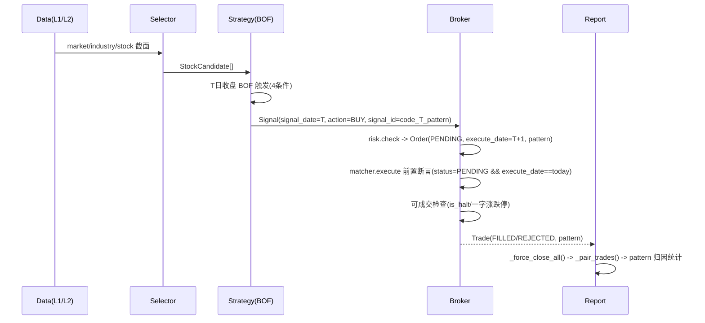
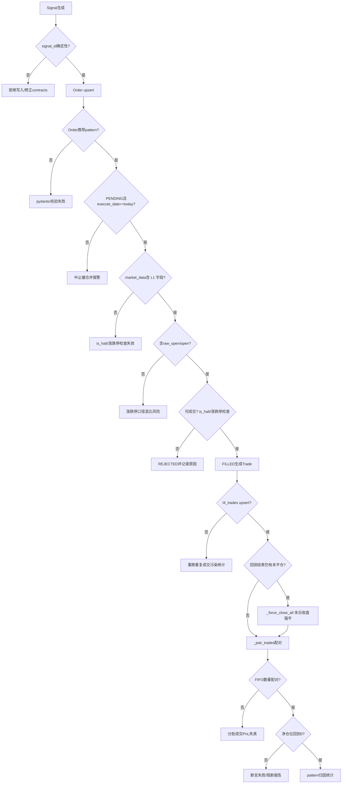

# EmotionQuant 低频量化重构总纲（v0.01）

**状态**: Frozen（当前唯一执行口径）  
**生效日期**: 2026-03-02

## 1. 目标

构建一个低频、可回测、可执行、可复盘的 A 股结构交易系统，刻意避开高频与拥挤赛道。

系统只回答三件事：

1. 买谁：全市场缩池后的候选标的。
2. 何时买：T 日收盘触发即生成信号，T+1 开盘按开盘价买入。
3. 买多少/何时卖：R 风险仓位 + 失效优先退出。

## 2. v0.01 范围（强约束）

1. 形态触发器采用注册表机制，但 **仅启用 BOF（Spring/Upthrust）**。
2. BPB/TST/PB/CPB 全部在册，作为后续版本扩展，不进入 v0.01 实盘口径。
3. 扫描流程固定为两阶段：
   1. 全市场粗筛（5000 -> 约200）
   2. 候选池形态精扫（约200 -> 50~100 -> 最终信号）
4. 执行语义固定：`signal_date=T`，`execute_date=T+1`，成交价 `T+1 open`。

## 3. 模块边界

1. Data：缓存、增量更新、清洗、落库。
2. Selector：粗筛、分层、候选池排序，不输出买卖动作。
3. Strategy：注册表形态扫描，输出 Signal。
4. Broker：仓位、风控、撮合、退出。
5. Backtest/Report：回测与复盘统计。

### 3.1 结果契约（v0.01 字段冻结）

模块间只传递结果契约（pydantic 对象），字段口径如下：

1. `MarketScore`（MSS -> Selector）：`date, score, signal`
2. `IndustryScore`（IRS -> Selector）：`date, industry, score, rank`
3. `StockCandidate`（Selector -> Strategy）：`code, industry, score`
4. `Signal`（Strategy -> Broker）：`signal_id, code, signal_date, action, strength, pattern, reason_code`
5. `Order`（Broker 内部 risk -> matcher）：`order_id, signal_id, code, action, quantity, execute_date, pattern, is_paper, status, reject_reason`
6. `Trade`（Broker -> Report）：`trade_id, order_id, code, execute_date, action, price, quantity, fee, pattern, is_paper`

`Signal.action` 在 v0.01 仅允许 `BUY`；`SELL` 由 Broker 风控层内部生成。
`Signal.signal_id` 采用确定性幂等键：`f"{code}_{signal_date}_{pattern}"`（重跑覆盖，不重复追加）。

## 4. v0.01 触发器口径（BOF）

做多 Spring 触发（全部满足）：

1. `Low < LowerBound * (1 - 1%)`
2. `Close >= LowerBound`
3. `Close` 位于当日振幅上部（收盘位置 >= 0.6）
4. `Volume >= SMA20(Volume) * 1.2`

执行语义（v0.01 冻结）：满足上述 4 条即在 **T 日收盘后** 生成 BUY 信号（`signal_date=T`），并在 **下一交易日开盘** 成交（`execute_date=T+1`，成交价 `T+1 open`）。**不存在入场前“等 1-2 日确认再买”的口径**；入场后的失效/退出由 Broker 风控层执行（见 §5）。

可复现口径补充（v0.01）：

1. `LowerBound` 定义为 `min(adj_low[t-20, t-1])`，窗口不足 20 个交易日时不触发。
2. 价格字段统一使用 `adj = raw × adj_factor` 口径（`adj_open/adj_high/adj_low/adj_close`），历史行不回写。
3. `SMA20(Volume)` 使用过去 20 个有效交易日（停牌日不计入窗口）。
4. 触发日/执行日均按交易日序列推进；`T+1` 指下一交易日。
5. 一字涨停/一字跌停/停牌日不作为可成交触发样本；可记录观察但不得下单。

## 5. 风控口径（v0.01）

1. 单笔账户风险：`0.8%`
2. 次日不延续：退出
3. 收盘跌回结构内：退出
4. 同标的连续3次失败：冻结120天

执行与成本约束（v0.01）：

1. 单只仓位不得超过账户净值 `10%`（上限约束，不等于默认等权）。
2. 费用模型最小包含：佣金、印花税（卖出侧）、过户费；参数由 `config.py` 注入。
3. `is_halt=true`、买入开盘触及涨停、卖出开盘触及跌停时，订单应标记为 `REJECTED`。

## 6. 验收口径

1. 单形态回测（BOF）可独立运行。
2. 输出分环境统计（牛/震荡/熊）。
3. 报告必须包含中位数路径，不以最佳路径作为结论。

### 6.1 漏斗有效性验证顺序（强制）

MSS/IRS 在 v0.01 视为待验证假设，必须按以下顺序做消融对照：

1. `BOF baseline`：关闭 `ENABLE_MSS_GATE` 与 `ENABLE_IRS_FILTER`。
2. `BOF + MSS`：仅开启 MSS 开关。
3. `BOF + MSS + IRS`：再开启 IRS 过滤。

每一步都必须输出同口径对照指标：胜率、盈亏比、期望值、最大回撤、分环境中位数路径。
若开启新漏斗后指标未改善或显著恶化，必须回退到前一配置。

### 6.2 通过阈值与回退门（v0.01）

1. `BOF baseline` 通过门（最低要求）：
   1. `expected_value >= 0`
   2. `profit_factor >= 1.05`
   3. `max_drawdown <= 25%`
   4. `trade_count >= 60`（样本不足只可标记为观察，不得宣告通过）
2. 新漏斗（如 `+MSS`、`+IRS`）相对前一配置触发回退条件（任一满足即回退）：
   1. `expected_value` 下降超过 `10%`
   2. `max_drawdown` 恶化超过 `20%`
   3. 任一市场环境的中位数路径由正转负且连续两个评估窗未恢复
3. 验收报告必须同时给出：参数快照、样本区间、环境切分口径、回退判定结果。

### 6.3 Gene 模块使用规则（v0.01-v0.02）

1. v0.01 禁止启用 `ENABLE_GENE_FILTER`（保持关闭）。
2. gene 仅允许做事后分析：基于 BOF 历史交易样本反推候选特征。
3. v0.02 之前，不允许将“5牛5衰”定义作为硬过滤进入实盘流程。

## 7. 版本演进

1. v0.02：加入 BPB（与 BOF 并行评估，仍可单形态回测）。
2. v0.03：加入 TST/PB/CPB 与组合模式评估。

晋级门槛（必须同时满足）：

1. v0.01 连续两个评估窗通过 §6.2 且无强制回退。
2. 新增形态在单形态回测中先独立通过，再进入组合评估。
3. 任何新增模块不得破坏 `T+1 Open` 执行语义与结果契约字段冻结规则。

## 8. 冲突处理规则

若 `docs/design-v2/` 其他文档与本文件冲突，**以本文件为准**。

## 9. 沙盘模拟与偏差闭环（2026-03-02）

### 9.1 端到端沙盘主链路（v0.01）

### 9.2 偏差清单与修复结果（A-E）

1. A 类（时序/语义）
   1. A1：删除“1-2 日确认再买”；固定 `T 触发 -> T+1 Open`。
   2. A2：交易日历按低频一次下载维护，无需新增设计分支。
2. B 类（复权/调整）
   1. B3：复权统一为 `adj = raw × adj_factor`，历史行不回写。
   2. B4：rolling 前先过滤 `is_halt=true`，算完再 merge back。
3. C 类（维度/映射）
   1. C5：`stock_info` 关联路径改“子查询/ASOF JOIN/临时物化”三选一优化。
   2. C6：分板阈值补齐北交所 30%（strong=15%），并强制单测覆盖。
4. D 类（幂等/重跑）
   1. D7：`signal_id` 改为确定性键 `f"{code}_{signal_date}_{pattern}"`；写入从 `bulk_insert` 调整为 `bulk_upsert`。
   2. D8：`matcher.execute()` 入口强制断言：`status==PENDING && execute_date==today`。
5. E 类（回测/报告）
   1. E9：`_pair_trades` 增加 `len(buys)==len(sells)` 断言；`stop()` 执行 `_force_close_all()` 末日收盘强平。
   2. E10：`Order/Trade` 均冗余 `pattern`，归因链直连，报告阶段无需 JOIN 信号表。

### 9.3 偏差清单与修复结果（F-G，第二轮）

6. F 类（字段/Schema 不对齐）
   1. F11：`l4_orders` / `l4_trades` DDL 补充 `pattern VARCHAR NOT NULL` 列。
   2. F12：BUY Order 创建 (`check_signal`) 补 `pattern=signal.pattern`。
   3. F13：SELL Order 创建 (`check_positions`、回撤清仓) 补 `pattern=position.pattern`。
   4. F14：`Position` dataclass 新增 `pattern: str` 字段（与 `signal_type` 并存）。
7. G 类（数据流缺失）
   1. G15：`_get_market_data` 改为 L2 LEFT JOIN L1，补充 `raw_open` / `is_halt` / `up_limit` / `down_limit`。
   2. G16：组合回撤 NAV 计算加 `if not p.is_paper` 过滤，与仓位计算保持一致。

### 9.4 偏差清单与修复结果（H，第三轮）

8. H 类（残余一致性风险）
   1. H17：回测写 `l4_trades` 全链路改 `bulk_upsert`（按 `trade_id` 幂等覆盖），避免重跑重复成交。
   2. H18：涨跌停可成交检查改“原始价口径”(`raw_open/open` 对 `up_limit/down_limit`)，避免复权价混比误判。
   3. H19：`_pair_trades` 改 FIFO 数量配对，支持分批成交/分批平仓；断言改为“无负仓位 + 期末净仓位为 0”。
   4. H20：`l2_market_snapshot` DDL 注释补齐北交所阈值（`±15%`）避免实现回退。

### 9.5 防偏差控制点图（A-H）

