# EmotionQuant 低频量化系统基线（v0.01）

**版本**: v0.01 正式版  
**状态**: Frozen（执行语义冻结；算法级 SoT 已于 2026-03-06 受控补齐）  
**生效日期**: 2026-03-03  
**变更规则**: 执行语义变更必须进入下一版本（v0.02+）；算法权威入口、数据分类口径与链接修复允许在不改变执行语义前提下做受控纠偏。  
**数据运维记录**: `docs/spec/v0.01/records/data-rebuild-runbook-20260303.md`

## 1. 目标

构建一个低频、可回测、可执行、可复盘的 A 股结构交易系统，刻意避开高频与拥挤赛道。

系统只回答三件事：

1. 买谁：全市场缩池后的候选标的。
2. 何时买：T 日收盘触发即生成信号，T+1 开盘按开盘价买入。
3. 买多少/何时卖：R 风险仓位 + 失效优先退出。

## 2. v0.01 范围（强约束）

1. 形态触发器采用注册表机制，但 **仅启用 BOF（Spring/Upthrust）**。
2. BPB/TST/PB/CPB 全部在册，作为后续版本扩展，不进入 v0.01 实盘口径。
3. 扫描流程固定为两阶段：
   1. 全市场粗筛（5000 -> 约200）
   2. 候选池形态精扫（约200 -> 50~100 -> 最终信号）
4. 执行语义固定：`signal_date=T`，`execute_date=T+1`，成交价 `T+1 open`。

## 3. 模块边界

1. Data：缓存、增量更新、清洗、落库。
2. Selector：粗筛、分层、候选池排序，不输出买卖动作。
3. Strategy：注册表形态扫描，输出 Signal。
4. Broker：仓位、风控、撮合、退出。
5. Backtest/Report：回测与复盘统计。

### 3.0 算法权威入口

系统级 SoT 仍以本文件为准；算法级 SoT 入口如下：

1. `mss-algorithm.md`
2. `irs-algorithm.md`
3. `pas-algorithm.md`

口径规则：

1. 本文件负责执行语义、模块边界、结果契约与版本范围。
2. `*-algorithm.md` 负责 MSS / IRS / PAS 的当前算法定义、输入边界、校准问题与正式口径。
3. `docs/spec/v0.01/records/` 仅保留阶段证据与决策记录，不再承担算法 SoT 职责。
4. `docs/reference/core-algorithms/` 为历史研究参考，不作为 v0.01 执行口径。

### 3.1 结果契约（v0.01 字段冻结）

模块间只传递结果契约（pydantic 对象），字段口径如下：

1. `MarketScore`（MSS -> Selector）：`date, score, signal`
2. `IndustryScore`（IRS -> Selector）：`date, industry, score, rank`
3. `StockCandidate`（Selector -> Strategy）：`code, industry, score`
4. `Signal`（Strategy -> Broker）：`signal_id, code, signal_date, action, strength, pattern, reason_code`
5. `Order`（Broker 内部 risk -> matcher）：`order_id, signal_id, code, action, quantity, execute_date, pattern, is_paper, status, reject_reason`
6. `Trade`（Broker -> Report）：`trade_id, order_id, code, execute_date, action, price, quantity, fee, pattern, is_paper`

`Signal.action` 在 v0.01 仅允许 `BUY`；`SELL` 由 Broker 风控层内部生成。
`Signal.signal_id` 采用确定性幂等键：`f"{code}_{signal_date}_{pattern}"`（重跑覆盖，不重复追加）。

## 4. v0.01 触发器口径（BOF）

做多 Spring 触发（全部满足）：

1. `Low < LowerBound * (1 - 1%)`
2. `Close >= LowerBound`
3. `Close` 位于当日振幅上部（收盘位置 >= 0.6）
4. `Volume >= SMA20(Volume) * 1.2`

执行语义（v0.01 冻结）：满足上述 4 条即在 **T 日收盘后** 生成 BUY 信号（`signal_date=T`），并在 **下一交易日开盘** 成交（`execute_date=T+1`，成交价 `T+1 open`）。**不存在入场前“等 1-2 日确认再买”的口径**；入场后的失效/退出由 Broker 风控层执行（见 §5）。

可复现口径补充（v0.01）：

1. `LowerBound` 定义为 `min(adj_low[t-20, t-1])`，窗口不足 20 个交易日时不触发。
2. 价格字段统一使用 `adj = raw × adj_factor` 口径（`adj_open/adj_high/adj_low/adj_close`），历史行不回写。
3. `SMA20(Volume)` 使用过去 20 个有效交易日（停牌日不计入窗口）。
4. 触发日/执行日均按交易日序列推进；`T+1` 指下一交易日。
5. 一字涨停/一字跌停/停牌日不作为可成交触发样本；可记录观察但不得下单。

## 5. 风控口径（v0.01）

1. 单笔账户风险：`0.8%`
2. 次日不延续：退出
3. 收盘跌回结构内：退出
4. 同标的连续3次失败：冻结120天

执行与成本约束（v0.01）：

1. 单只仓位不得超过账户净值 `10%`（上限约束，不等于默认等权）。
2. 费用模型最小包含：佣金、印花税（卖出侧）、过户费；参数由 `config.py` 注入。
3. `is_halt=true`、买入开盘触及涨停、卖出开盘触及跌停时，订单应标记为 `REJECTED`。

## 6. 验收口径

1. 单形态回测（BOF）可独立运行。
2. 输出分环境统计（牛/震荡/熊）。
3. 报告必须包含中位数路径，不以最佳路径作为结论。

### 6.1 漏斗有效性验证顺序（强制）

MSS/IRS 在 v0.01 视为待验证假设，必须按以下顺序做消融对照：

1. `BOF baseline`：关闭 `ENABLE_MSS_GATE` 与 `ENABLE_IRS_FILTER`。
2. `BOF + MSS`：仅开启 MSS 开关。
3. `BOF + MSS + IRS`：再开启 IRS 过滤。

每一步都必须输出同口径对照指标：胜率、盈亏比、期望值、最大回撤、分环境中位数路径。
若开启新漏斗后指标未改善或显著恶化，必须回退到前一配置。

### 6.2 通过阈值与回退门（v0.01）

1. `BOF baseline` 通过门（最低要求）：
   1. `expected_value >= 0`
   2. `profit_factor >= 1.05`
   3. `max_drawdown <= 25%`
   4. `trade_count >= 60`（样本不足只可标记为观察，不得宣告通过）
2. 新漏斗（如 `+MSS`、`+IRS`）相对前一配置触发回退条件（任一满足即回退）：
   1. `expected_value` 下降超过 `10%`
   2. `max_drawdown` 恶化超过 `20%`
   3. 任一市场环境的中位数路径由正转负且连续两个评估窗未恢复
3. 验收报告必须同时给出：参数快照、样本区间、环境切分口径、回退判定结果。

### 6.3 Gene 模块使用规则（v0.01-v0.02）

1. v0.01 禁止启用 `ENABLE_GENE_FILTER`（保持关闭）。
2. gene 仅允许做事后分析：基于 BOF 历史交易样本反推候选特征。
3. v0.02 之前，不允许将“5牛5衰”定义作为硬过滤进入实盘流程。

## 7. 版本演进

1. v0.02：加入 BPB（与 BOF 并行评估，仍可单形态回测）。
2. v0.03：加入 TST/PB/CPB 与组合模式评估。

晋级门槛（必须同时满足）：

1. v0.01 连续两个评估窗通过 §6.2 且无强制回退。
2. 新增形态在单形态回测中先独立通过，再进入组合评估。
3. 任何新增模块不得破坏 `T+1 Open` 执行语义与结果契约字段冻结规则。

## 8. 冲突处理规则

若 `docs/design-v2/` 其他文档与本文件冲突，**以本文件为准**。

### 8.1 沙盘评审标准入口

沙盘推演与偏差闭环统一按 `docs/design-v2/sandbox-review-standard.md` 执行（七维评审框架、证据模板、定稿门禁）。

### 8.2 研究附录入口（非约束）

`docs/reference/未来之路/god_view_8_perspectives_report_v0.01.md` 作为系统观察框架与版本演进研究附录保留。

口径约束：

1. 该附录用于补充观察维度与路线思考，不作为 v0.01 的强制实现条款。
2. 涉及 `v0.02+` 的分桶/分层/生态管理/组合层建议，仅在对应版本评审通过后纳入执行口径。
3. 若附录与本文件冲突，仍以本文件（Frozen）为准。

## 9. 沙盘模拟与偏差闭环（2026-03-02）

### 9.1 端到端沙盘主链路（v0.01）

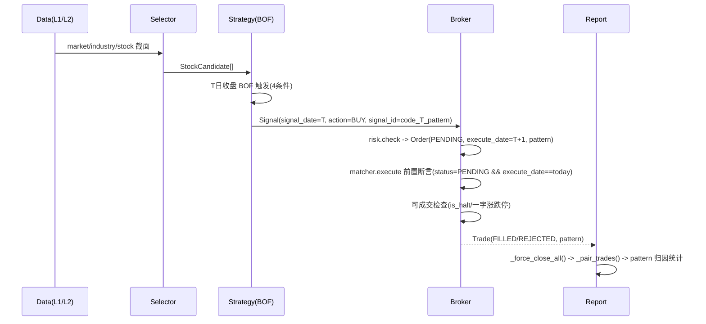

### 9.2 偏差清单与修复结果（A-E）

1. A 类（时序/语义）
   1. A1：删除“1-2 日确认再买”；固定 `T 触发 -> T+1 Open`。
   2. A2：交易日历按低频一次下载维护，无需新增设计分支。
2. B 类（复权/调整）
   1. B3：复权统一为 `adj = raw × adj_factor`，历史行不回写。
   2. B4：rolling 前先过滤 `is_halt=true`，算完再 merge back。
3. C 类（维度/映射）
   1. C5：`stock_info` 关联路径改“子查询/ASOF JOIN/临时物化”三选一优化。
   2. C6：分板阈值补齐北交所 30%（strong=15%），并强制单测覆盖。
4. D 类（幂等/重跑）
   1. D7：`signal_id` 改为确定性键 `f"{code}_{signal_date}_{pattern}"`；写入从 `bulk_insert` 调整为 `bulk_upsert`。
   2. D8：`matcher.execute()` 入口强制断言：`status==PENDING && execute_date==today`。
5. E 类（回测/报告）
   1. E9：`_pair_trades` 增加 `len(buys)==len(sells)` 断言；`stop()` 执行 `_force_close_all()` 末日收盘强平。
   2. E10：`Order/Trade` 均冗余 `pattern`，归因链直连，报告阶段无需 JOIN 信号表。

### 9.3 偏差清单与修复结果（F-G，第二轮）

6. F 类（字段/Schema 不对齐）
   1. F11：`l4_orders` / `l4_trades` DDL 补充 `pattern VARCHAR NOT NULL` 列。
   2. F12：BUY Order 创建 (`check_signal`) 补 `pattern=signal.pattern`。
   3. F13：SELL Order 创建 (`check_positions`、回撤清仓) 补 `pattern=position.pattern`。
   4. F14：`Position` dataclass 新增 `pattern: str` 字段（与 `signal_type` 并存）。
7. G 类（数据流缺失）
   1. G15：`_get_market_data` 改为 L2 LEFT JOIN L1，补充 `raw_open` / `is_halt` / `up_limit` / `down_limit`。
   2. G16：组合回撤 NAV 计算加 `if not p.is_paper` 过滤，与仓位计算保持一致。

### 9.4 偏差清单与修复结果（H，第三轮）

8. H 类（残余一致性风险）
   1. H17：回测写 `l4_trades` 全链路改 `bulk_upsert`（按 `trade_id` 幂等覆盖），避免重跑重复成交。
   2. H18：涨跌停可成交检查改“原始价口径”(`raw_open/open` 对 `up_limit/down_limit`)，避免复权价混比误判。
   3. H19：`_pair_trades` 改 FIFO 数量配对，支持分批成交/分批平仓；断言改为“无负仓位 + 期末净仓位为 0”。
   4. H20：`l2_market_snapshot` DDL 注释补齐北交所阈值（`±15%`）避免实现回退。

### 9.5 偏差清单与修复结果（I，第三轮续）

9. I 类（状态守卫 / 确定性 / 时间参数）
   1. I21：`check_signal` 缺少重复持仓守卫（同一只股票已在 portfolio 时不应再开 BUY），新增 `if signal.code in broker_state.portfolio: return None`。
   2. I22：`order_id` / `trade_id` 仍为 `uuid4()`（非确定性），H17 的 upsert 实际追加而非覆盖。改造：`order_id = signal_id`（BUY/SELL 均确定性），`trade_id = f"{order_id}_T"`，`FORCE_CLOSE` 用 `f"FC_{code}_{date}_T"`。
   3. I23：`_is_loss_circuit_breaker_active` 使用 `date.today()` 而非回测模拟日期，导致连亏熔断在回测中永远不触发。改为接受 `today_date: date` 参数。

### 9.6 偏差清单与修复结果（J，第四轮）

10. J 类（调用链参数传递 / 文档一致性）
    1. J24：`check_signal` 缺 `today_date` 参数，I23 修过的 `_is_loss_circuit_breaker_active(today_date)` 在调用处缺参。统一修复：`check_signal` / `_is_drawdown_circuit_breaker_active` 签名加 `today_date`，`next()` 调用处传入 `today`。
    2. J25：`architecture-master.md` §8 幂等键说明仍写 `order_id = uuid4()`，与 I22 修复矛盾。已改为 `order_id = signal_id` + `trade_id = f"{order_id}_T"`；contracts.py `from uuid import uuid4` 已移除。
    3. J26：`_check_intraday_loss` 引用未定义变量 `today`，签名改为 `(self, position, trade_date: date, today_close)`，调用处同步传入 `trade_date`。

### 9.7 防偏差控制点图（A-J）

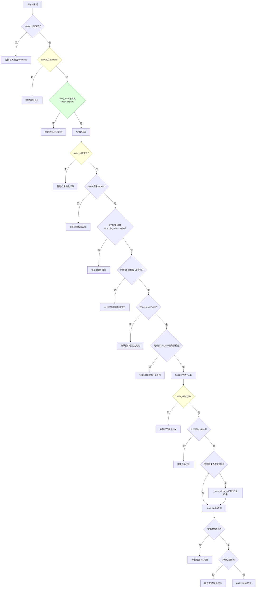

### 9.8 偏差清单与修复结果（K，第五轮）

11. K 类（签名缺失 / 实现缺失 / API 缺失 / 审计链断裂）
    1. K27：`check_positions` 函数体 line 333 使用 `broker_state`（组合回撤检查），但函数签名无此参数 → 运行时 `NameError`。修复：签名加 `broker_state` 参数，`Broker.update_daily()` 调用时传 `self`。
    2. K28：`_is_drawdown_circuit_breaker_active` 在 `check_signal` 中被调用但全文无实现（`_is_loss_circuit_breaker_active` 有完整实现）。且 `Broker.__init__` 缺 `force_bearish_until` 属性（`_check_portfolio_drawdown` 写入该属性，首次读取会 `AttributeError`）。修复：`Broker.__init__` 加 `self.force_bearish_until: date | None = None`；补 `_is_drawdown_circuit_breaker_active` 实现。
    3. K29：`_calculate_position_size` 调用 `self.store.read_scalar()`，但 `data-layer-design.md` Store 接口无 `read_scalar` 方法 → 运行时 `AttributeError`。修复：Store 接口补 `read_scalar(sql, params) -> scalar | None`。
    4. K30：`backtest next()` 显式 upsert `l4_trades`，但从未写 `l4_orders`，审计链 Signal→**Order**→Trade 中间环节断裂。`_force_close_all` 同理。修复：`next()` 三处补 `l4_orders` upsert（BUY PENDING / SELL PENDING / 执行后 FILLED|REJECTED），`_force_close_all` 补 FC Order 持久化。

### 9.9 防偏差控制点图（A-K）

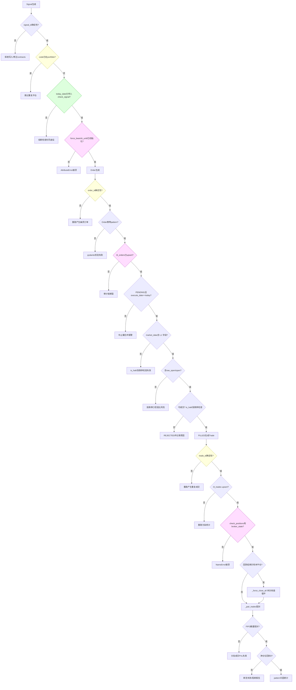

### 9.10 偏差清单与修复结果（L，第六轮）

12. L 类（调用链参数缺失 / 信任系统集成遗漏）
    1. L31：`Matcher.execute` 类级签名缺 `today: date`（实现有），`Broker.execute_orders` 签名也缺 `today: date`，`next()` 调用未传 `today`。同一条调用链 `next() → execute_orders → matcher.execute` 三层断裂。与 K27 (`check_positions` 缺 `broker_state`) 完全同一模式。修复：Matcher 类级签名加 `today: date`；`execute_orders` 签名加 `today: date`；`next()` 调用传 `today`。
    2. L32：`next()` 执行订单后只做 l4_orders/l4_trades 持久化，**从未调用** `risk.update_trust(code, trade)`。生命周期图（broker-design.md §6.1）明确写 Trade 后应调用 `update_trust`，但 `next()` 代码未执行。后果：ACTIVE→OBSERVE→BACKUP 状态转换永远不触发，信任分级系统成死代码。修复：`next()` step 1 的 `for trade in trades` 循环内追加 `self.broker_engine.risk.update_trust(trade.code, trade)`。

### 9.11 防偏差控制点图（A-L）

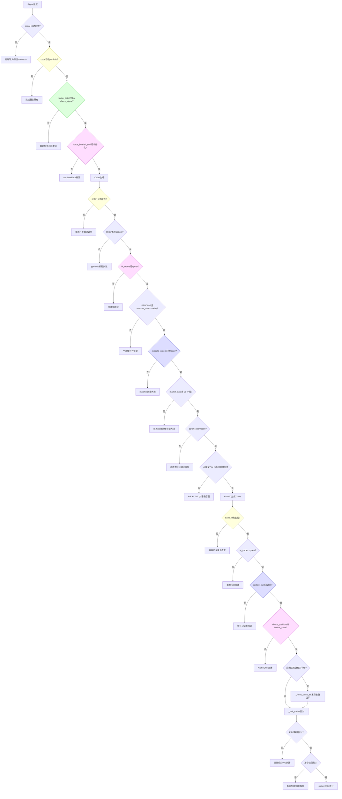

### 9.12 偏差清单与修复结果（M，第七轮）

13. M 类（报告口径 / 函数缺失 / 接口不匹配 / 信任升级死路径）
    1. M33：`_pair_trades` 的 `pnl_pct` 使用毛收益率 `(exit_price - entry_price) / entry_price`，未扣除手续费。但 v0.01 强制项要求“报告必须展示手续费+滑点后的净表现”。后果：胜率与期望值偏高，微利交易会被错误归为盈利（A股单笔往返费用约 0.16%）。修复：`pnl_pct = pnl / (buy_price * matched_qty)`，使用已扣费的 `pnl` 计算净收益率。
    2. M34：`_offset_trade_date(base_date, n_days)` 在 `_check_portfolio_drawdown`（回撤熔断冷却截止日）和 `_is_loss_circuit_breaker_active`（连亏熔断冷却截止日）两处被调用，但 §7.2 只实现了 `_next_trade_date` 和 `_trading_days_between`，从未定义 `_offset_trade_date`。运行时将 `AttributeError` 崩溃。修复：§7.2 补充 `_offset_trade_date` 实现（查询 `l1_trade_calendar` 获取向后偏移的交易日）。
    3. M35：`strategy.generate_signals` 调用 `store.bulk_upsert("l3_signals", signals_df, key=["signal_id"])`，但 `Store.bulk_upsert` 接口签名为 `(table, df)`，不接受 `key`。运行时 `TypeError`。修复：去掉 `key` 参数，依赖 DuckDB PK `signal_id` 做 upsert。
    4. M36：`_check_auto_promote` 已实现 BACKUP → OBSERVE 的 120 交易日自动升级，但无调用点。`check_signal` 仅读取 tier，导致 BACKUP 永不恢复，信任状态转换图中 BACKUP→OBSERVE 为死路径。修复：`check_signal` 开头（tier 读取前）调用 `self._check_auto_promote(signal.code, today_date)`。

### 9.13 防偏差控制点图（A-M）

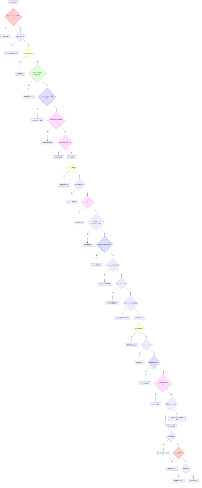

### 9.14 偏差清单与修复结果（N，第八轮）

14. N 类（报告函数入参不匹配 / Store 接口类型标注）
    1. N37：`_compute_pattern_stats(paired, trade_date)` 对每个 pattern 分组后调用 `_compute_expectation(group)`，但 `_compute_expectation` 内部再次调用 `_pair_trades(trades_df)` 做 BUY/SELL 配对。此时 `group` 是已配对数据（列为 `entry_date/exit_date/pnl_pct` 等），缺少 `action/price/fee/trade_id`，`_pair_trades` 在 `t.action == "BUY"` 处触发 `AttributeError` 崩溃。修复：`_compute_expectation` 签名改为 `(paired: pd.DataFrame)`，移除内部 `_pair_trades` 调用；调用方先执行 `paired = _pair_trades(trades_df)` 再传入。
    2. N38：`Store.read_df` 签名声明 `params: dict = None`，但全系统 12+ 个调用点均传入 `tuple`，SQL 统一使用 `?` 位置占位符（DuckDB 要求 tuple/list）。同文件 `read_scalar` 正确标注为 `params: tuple = None`。修复：`read_df` 参数类型改为 `params: tuple = None`。

### 9.15 防偏差控制点图（A-N）

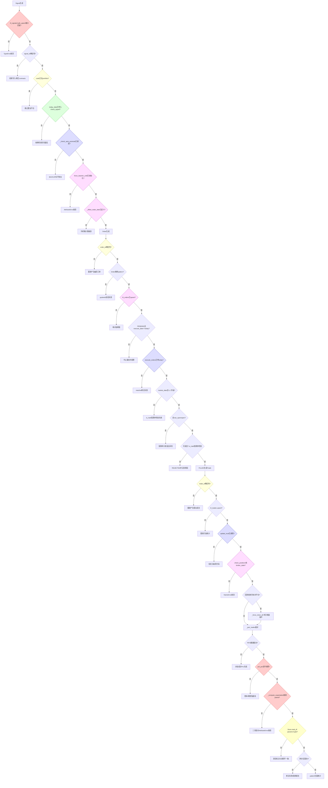

### 9.16 偏差清单与修复结果（O，第九轮）

15. O 类（分批配对费用分摊精度）
    1. O39：`_pair_trades` 买方手续费分摊公式 `buy["fee"] * (matched_qty / buy["qty"])` 中 `buy["qty"]` 在每次部分匹配后被 `-= matched_qty` 递减。第二次及后续匹配时分母缩小，分摊比例膨胀，导致买方费用超额分配。示例：BUY 500 fee=15，分两次 SELL(200+300) 平仓，实际分配 6+15=21 > 实际 15。设计明确声称“支持分批成交/分批平仓”（_pair_trades docstring），但分批场景下 pnl/pnl_pct 因费用虚高而失真。v0.01 因无部分成交且有重复持仓守卫不会触发，但承诺能力有缺陷。卖方不受影响（`t.quantity` 来自 itertuples 不可变）。修复：buy_queue 入队时新增 `"original_qty": t.quantity`，分摊分母改为 `buy["original_qty"]`。

### 9.17 防偏差控制点图（A-O）

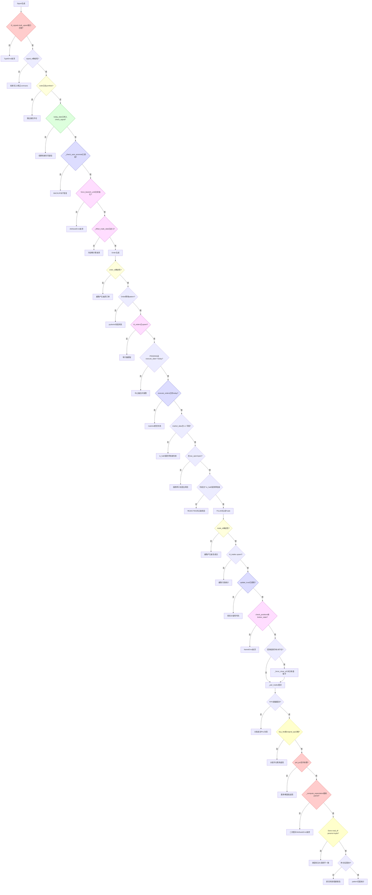

### 9.18 偏差清单与修复结果（P，第十轮）

16. P 类（止损/回撤清仓重复卖出）
    1. P40：`check_positions` 中个股止损循环和组合回撤循环可对同一 code 同日生成两笔 SELL 订单。当某只持仓同时满足个股止损条件（INTRADAY_LOSS/STOP_LOSS/TRAILING_STOP）且组合回撤达到 `MAX_DRAWDOWN_PCT` 时，第一段 for 循环产出 `RISK_{code}_{date}` SELL Order，随后 `_check_portfolio_drawdown` 触发再产出 `DRAWDOWN_{code}_{date}` SELL Order。两笔均为 PENDING 于同一 `execute_date`，次日均被 matcher 撮合成功，生成两笔 SELL Trade。在 `_pair_trades` 中 SELL 总数量 > BUY 总数量，触发 `ValueError("SELL 数量超过 BUY 库存")`，回测报告崩溃。触发场景：市场急跌日个股跌超止损线、同时组合净值回撤超限（完全可达）。修复：drawdown 循环前收集 `already_selling = {o.code for o in sell_orders}`，循环条件加 `code not in already_selling`，保证每只持仓至多生成一笔 SELL。

### 9.19 防偏差控制点图（A-P）

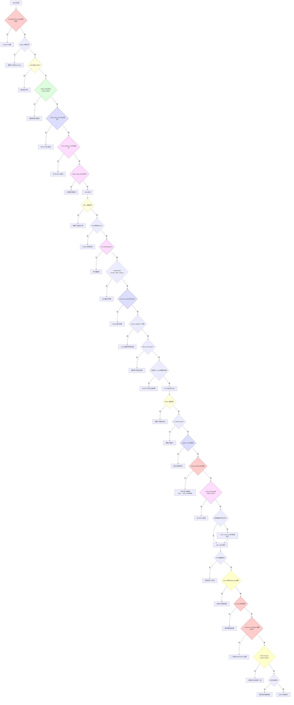

### 9.20 偏差清单与修复结果（Q，第十一轮）

17. Q 类（BUY/SELL 未区分导致信任与熔断失效）
    1. Q41：`_is_loss_circuit_breaker_active` SQL 查询 `SELECT * FROM l4_trades WHERE is_paper = false ORDER BY execute_date DESC LIMIT ?` 同时取出 BUY 和 SELL 记录。BUY 记录无法判定盈亏（持仓未了结），`_is_trade_loss(BUY)` 返回 False，导致 BUY 与 SELL 交错时 `all()` 恒为 False → 连亏熔断永远不触发。修复：SQL 加 `AND action = 'SELL'`，仅对已平仓交易判定连续亏损。
    2. Q42：`next()` 对所有 trade（含 BUY）调用 `update_trust(trade.code, trade)`。BUY trade 的 `is_loss = price < _get_entry_price()` 恒为 False（买价等于入场价），导致两个关键故障：(a) ACTIVE 层每笔 BUY 将 `consecutive_losses` 归零 → 3 连亏降级永远不触发；(b) OBSERVE 层纸上 BUY（`is_paper=True, is_loss=False`）满足 `is_paper and not is_loss` → 立即升回 ACTIVE，OBSERVE 形同虚设。信任分级体系完全失效。修复：`next()` 循环内 `update_trust` 调用前加 `if trade.action == "SELL":` 守卫，仅对已平仓交易更新信任状态。

### 9.21 防偏差控制点图（A-Q）

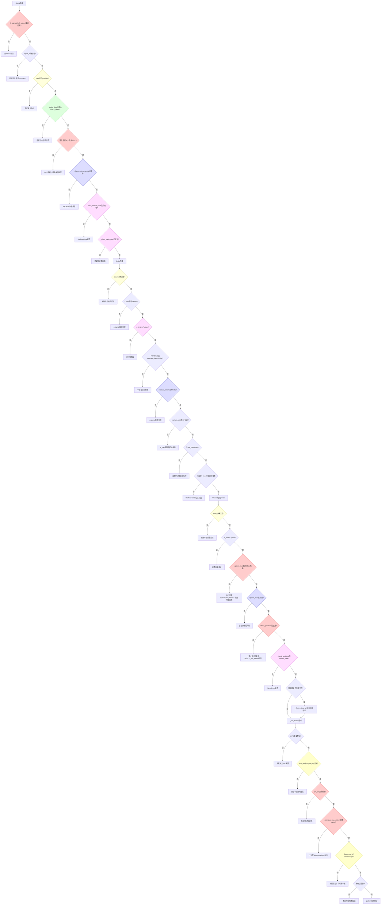

### 9.22 偏差清单与修复结果（R，第十二轮）

18. R 类（paper 持仓生命周期断裂 → 信任升级失效）
    1. R43：`check_positions` 对 `is_paper=True` 持仓执行 `continue`，导致五级联动故障：(a) paper 持仓永远不触发止损/止盈 → 不生成 paper SELL 订单；(b) Q42 修复后 `update_trust` 仅对 SELL 触发，但 paper SELL 从不产生 → `update_trust` 永远不对 OBSERVE 股票执行；(c) `update_trust` 中 OBSERVE→ACTIVE 升级路径（`is_paper and not is_loss → 升回 ACTIVE`）永远不可达；(d) paper 持仓在 portfolio 中永久驻留（仅 `force_close_all` 回测末日才清理），同一股票代码无法再接收新信号（check_signal step 4 重复持仓检查）；(e) 组合回撤清仓也仅清理 non-paper 持仓，paper 持仓残留。与 M36（BACKUP→OBSERVE）不同，本偶差是 OBSERVE→ACTIVE 路径。修复：(1) 个股止损循环移除 `if position.is_paper: continue`，SELL 订单继承 `is_paper=position.is_paper`；(2) 组合回撤循环移除 `not position.is_paper` 条件，同样继承 paper 标记。

### 9.23 防偏差控制点图（A-R）

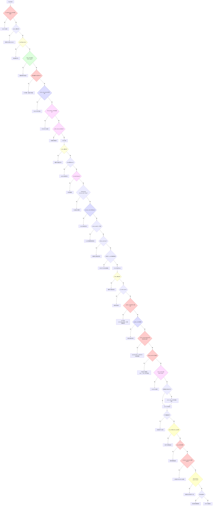

### 9.24 偏差清单与修复结果（S，第十三轮）

19. S 类（升级后试用期缺失 → 信任降级不足）
    1. S44：`update_trust` 对「正常 ACTIVE」与「OBSERVE 升级后的 ACTIVE」无区分。`architecture-master.md` 明确规定「OBSERVE 期间模拟验证通过后恢复到 ACTIVE，若真买再亏 → 降为 BACKUP」及「升级后再亏 → 立即降回上一级」，但实现中 ACTIVE 分支统一走 3 连亏才降 OBSERVE，升级后即使首笔真实交易亏损也不触发降级。修复：(1) `l4_stock_trust` DDL 加 `on_probation BOOLEAN DEFAULT FALSE`；(2) OBSERVE→ACTIVE 升级时设 `on_probation=True`；(3) `update_trust` ACTIVE 分支新增试用期判断：`on_probation + is_loss → 立即 BACKUP`，`on_probation + not is_loss → on_probation=False`（试用通过转正式 ACTIVE）。

### 9.25 防偏差控制点图（A-S）

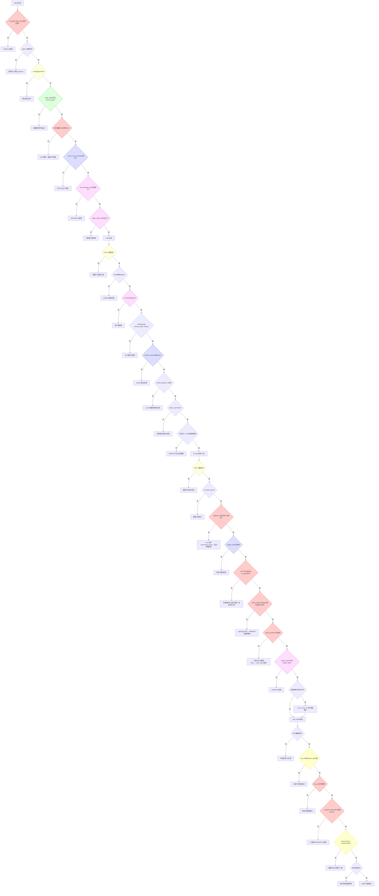

