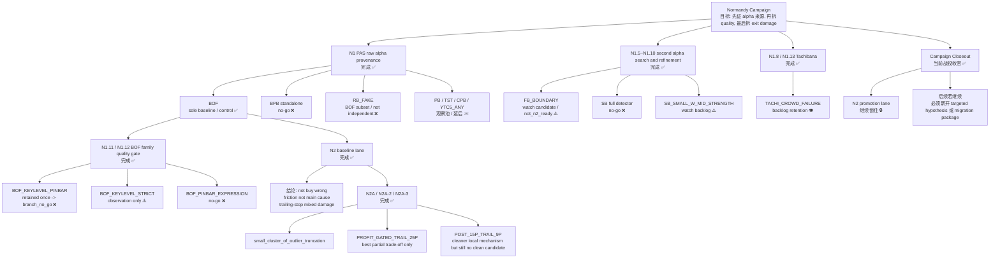

# Normandy Campaign Closeout Record

**日期**: `2026-03-13`  
**阶段**: `Normandy / campaign closeout`  
**对象**: `current Normandy campaign formal closure, total map, and migration boundary`  
**状态**: `Active`

---

## 1. 目标

本文用于把 `Normandy` 当前这一整轮战役正式收官。

这张 record 只回答三件事：

1. 当前 `Normandy` 已定义的 cards 和 formal readouts 是否已经全部闭环
2. 整个战役最后到底得出了什么结论
3. 哪些结论现在可以迁回主线治理，哪些仍然只能留在研究线

---

## 2. 收官判定

当前 `Normandy` 的收官判定固定为：

1. `all_defined_cards_closed = yes`
2. `all_formal_records_closed = yes`
3. `active_normandy_main_queue = none`
4. `future_reentry_requires = new_targeted_hypothesis_or_explicit_mainline_migration_package`
5. `n2_promotion_lane_unlocked = no`

这意味着：

`Normandy` 当前不是“还有旧卡没跑完”，而是“当前定义过的战役卡已经全部跑完并正式裁决完毕”。

---

## 3. 战役总图

---

## 4. 一页结论表

| 战役段 | 核心问题 | 正式裁决 | 当前最重要对象 | 是否可直接迁回主线 |
|---|---|---|---|---|
| `N1` | 谁在提供 raw alpha | `BOF` 是唯一稳定 baseline；`BPB` standalone `no-go`；`RB_FAKE` 非独立 | `BOF_CONTROL` | `部分可迁`：只迁治理结论，不迁运行默认 |
| `N1.5 ~ N1.10` | 是否存在第二 alpha 主体 | `FB_BOUNDARY` 只到 watch candidate；`SB` full detector `no-go` | `FB_BOUNDARY` | `不可直接迁回` |
| `N1.8 / N1.13` | `Tachibana` 是否值得继续 formalize | `backlog_retention` | `TACHI_CROWD_FAILURE` | `不可直接迁回` |
| `N1.11 / N1.12` | BOF quality split 能否升格 | `BOF_KEYLEVEL_PINBAR = branch_no_go`；`BOF_KEYLEVEL_STRICT` 观察；`PINBAR_EXPRESSION` `no-go` | `BOF family` | `可迁负面约束`：promotion 必须先过长窗稳定性 |
| `N2 baseline lane` | 问题在 entry 还是 exit | `不是买错`；`execution friction` 不是主因；问题主要落在 trailing-stop mixed damage | `BOF_CONTROL` | `可迁治理口径` |
| `N2A` | trailing-stop 伤害是什么形状 | `small_cluster_of_outlier_truncation`，不是普遍 trend-premature-exit | `TRAILING_STOP subset` | `可迁负面约束`：不支持全局取消 trailing-stop |
| `N2A-2` | profit-gated preservation 是否成立 | `PROFIT_GATED_TRAIL_25P = best partial trade-off only` | `PROFIT_GATED_TRAIL_25P` | `不可直接迁回` |
| `N2A-3` | two-stage trailing 是否出现 clean candidate | `POST_15P_TRAIL_9P = cleaner local mechanism but still no clean candidate` | `POST_15P_TRAIL_9P` | `不可直接迁回` |

---

## 5. 可迁回主线的结论

这里能迁回主线的，不是“新默认参数”，而是治理结论和边界。

当前可以迁回主线的内容固定为：

1. `Normandy 是研究线，不是版本线；研究结论若要升格，必须先成 record，再迁回主线 SoT`
2. `baseline diagnosis lane` 与 `promotion lane` 必须分开；稳定 baseline 可以先做 exit diagnosis，不必等 promotion branch 先站稳
3. `promotion lane` 不能因为局部亮点、partial trade-off 或小样本分支就被提前打开
4. 当前没有证据支持把主线默认 `trailing-stop` 语义直接全局改写
5. 当前没有证据支持把 `BOF` family 的任何 quality branch 升格为新主位

一句话说：

`可迁回主线的是治理约束，不是新的默认运行参数。`

---

## 6. 只能留在研究线的结论

当前只能留在研究线、不能直接迁回主线的内容固定为：

1. `BOF_CONTROL` 作为 `Normandy` 内部唯一 baseline 的研究口径
2. `FB_BOUNDARY` 作为 retained watch candidate 的研究身份
3. `BOF_KEYLEVEL_STRICT` 作为 observation branch 的研究身份
4. `SB_SMALL_W_MID_STRENGTH` 作为 watch backlog branch 的研究身份
5. `Tachibana backlog retention` 的研究队列身份
6. `PROFIT_GATED_TRAIL_25P` 作为 best partial trade-off 的局部机制结论
7. `POST_15P_TRAIL_9P` 作为 cleaner local mechanism but still no clean candidate 的局部机制结论

这些结论当前都不足以翻译成：

`主线默认参数现在就该改。`

---

## 7. 当前不该做的事

收官之后，当前明确不该做：

1. 再把 `POST_15P_TRAIL_9P` 周围做无假设的机械微扫
2. 把 `N2A-3` 误读成“已经找到 clean preservation candidate”
3. 把 `BOF quality` 或 `FB_BOUNDARY` 误读成“已经可以开 N2 promotion lane”
4. 把 `Normandy` 的研究基线误写成主线默认运行口径
5. 把 backlog / watch / observation 对象重新拖回大混战

---

## 8. 若未来继续，只能怎么继续

若未来要重开 `Normandy`，只能走两条路之一：

1. `new_targeted_hypothesis`
   - 例如提出一个新的、可复核的 trailing-stop targeted mechanism hypothesis
   - 或提出一个新的、可复核的 retained branch hypothesis

2. `explicit_mainline_migration_package`
   - 把已经足够硬的治理结论整理成主线迁移包
   - 明确哪些迁主线 SoT，哪些继续只留研究线

也就是说：

`Normandy` 如果再开，不是续跑旧卡，而是必须新开治理段。`

---

## 9. 正式结论

当前 `Normandy campaign closeout` 的正式结论固定为：

1. 当前定义过的 `Normandy` cards 已全部闭环
2. 当前定义过的 `Normandy` formal records 已全部闭环
3. 当前战役已经完成它的核心使命：
   - 找到 raw alpha baseline
   - 验证 quality branch 不能升格
   - 把 baseline exit damage 拆到 trailing-stop targeted diagnosis
4. 当前没有产出任何可直接改写主线默认参数的 clean mechanism
5. 当前可以迁回主线的是治理边界与负面约束，不是新的运行默认值
6. `N2 promotion lane` 继续锁住
7. `Normandy` 当前战役正式收官；若未来继续，必须新开假设或新开迁移包

---

## 10. 一句话结论

`Normandy` 这一轮战役已经打完了：该证的证了，该砍的砍了，该锁的锁了；现在能迁回主线的是治理结论，不能迁的是局部机制和观察对象；若未来继续，只能新开假设，不再续跑旧卡。
